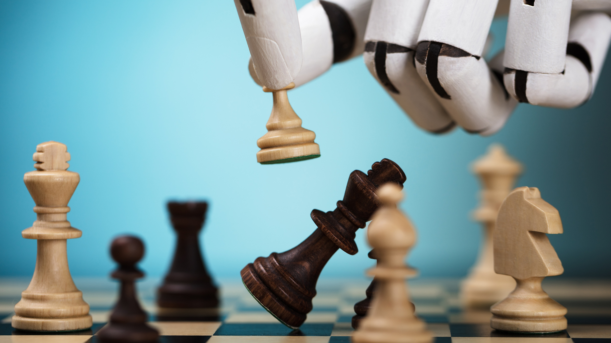

# AlphaZeroICGA

## Table des matières

1. [Presentation](#presentation-)
2. [Competition](#competition-)
3. [Environment](#environment-)
4. [Baseline](#baseline-)

## Presentation

Implementing deep reinforcement learning algorithms for the ICGA competition. This project is carried out for my 1st year of master internship at the LIP6 (Laboratoire d'Informatique de Paris 6 / Sorbonne University / CNRS).

## Competition

"The Ludii AI Competition involves general game playing events focussed on developing agents that can play a wide variety of board games. The events use the Ludii general game system to provide the necessary games and API. Games will be provided in the Ludii game description format (.lud). The version used for this competition (1.3.2) of Ludii includes over 1,000 games.

Three events are proposed :

- Kilothon: Best utility obtained on more than 1,000 games against UCT.
- General Game Playing (GGP): Competiton on games present or not in our library.
- Learning: A set of games are announced months before the actual competition, the agents are invited to learn before competing.
Each event will run if at least 3 participants take part in it."

Here we focus on the learning event.

Links : 
- https://icga.org/?page_id=3468
- https://github.com/Ludeme/LudiiAICompetition

## Games

The different games of the learning event this year are :
- Bashni: https://ludii.games/details.php?keyword=Bashni
- Ploy: https://ludii.games/details.php?keyword=Ploy
- Quoridor: https://ludii.games/details.php?keyword=Quoridor
- Mini Wars: https://ludii.games/details.php?keyword=Mini%20Wars
- Plakoto: https://ludii.games/details.php?keyword=Plakoto
- Lotus: https://ludii.games/details.php?keyword=Lotus

## Environment & Setup

The games are hosted on the Ludii software, which is in java. Since we use python for our algorithms we will need a java-python bridge such as **JPY**. Microsoft Visual C++ 14.0 and Java JDK 7.0 are required to build JPY.
We also need the **Ludii** software to run our algorithms in the environment.
We compile a jar file in order to export our AI on Ludii thanks to ant so it is also required even though you can do it otherwise.

Links : 
- https://github.com/Ludeme/LudiiPythonAI
- https://github.com/jpy-consortium/jpy
- https://visualstudio.microsoft.com/visual-cpp-build-tools/
- https://www.oracle.com/java/technologies/downloads/
- https://maven.apache.org/download.cgi
- https://ant.apache.org/bindownload.cgi
- https://ludii.games/download.php

First you need to clone Luddi and JPY repositories, then download C++ build and java JDK if you don't have it yet. Apache Maven is also required to build JPY. Once everything is installed go to the JPY folder and run :

`SET VS100COMNTOOLS=<visual-studio-tools-folder>`
`SET JDK_HOME=<your-jdk-dir>`
`SET PATH=<maven-bin-dir>`
`python setup.py build maven bdist_wheel`

If everything worked, you should have a build directory. Copy the content of the lib directory into the Ludii directory in a folder called `/LudiiPythonAI/libs/`. The Ludii jar file should also be moved to the libs directory. Finaly, you can build the jar file thanks to ant and the xml file, then export it in Ludii.

## Baseline

We use deep reinforcement learning algorithms for this competition and we start with AlphaZero as a baseline. AlphaGo is an algorithm which can play Go at a super-human level using supervised learning and reinforcement learning. AlphaGo Zero can basically do the same but starting from scratch, hence the "Zero" in its name. AlphaZero does the same but it is able to play different games such as Chess and Shogi.

Links : 
- https://www.nature.com/articles/nature16961 (AlphaGo)
- https://discovery.ucl.ac.uk/id/eprint/10045895/1/agz_unformatted_nature.pdf (AlphaGo Zero)
- https://arxiv.org/abs/1712.01815 (AlphaZero)
